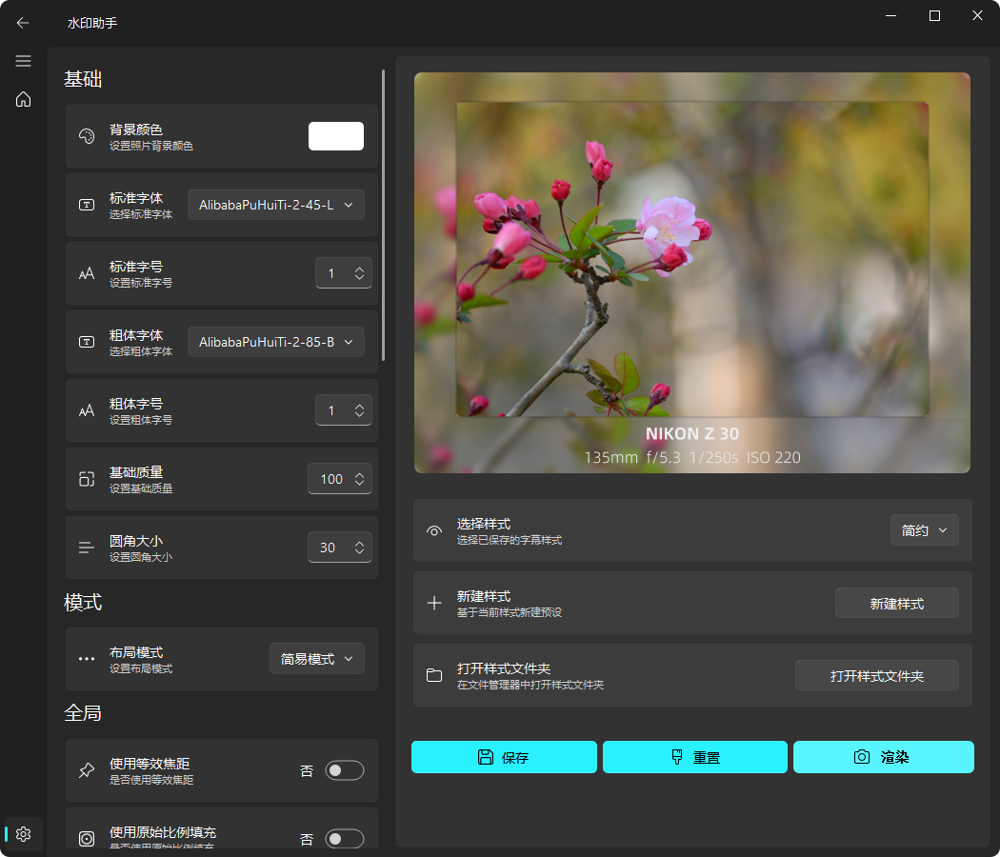
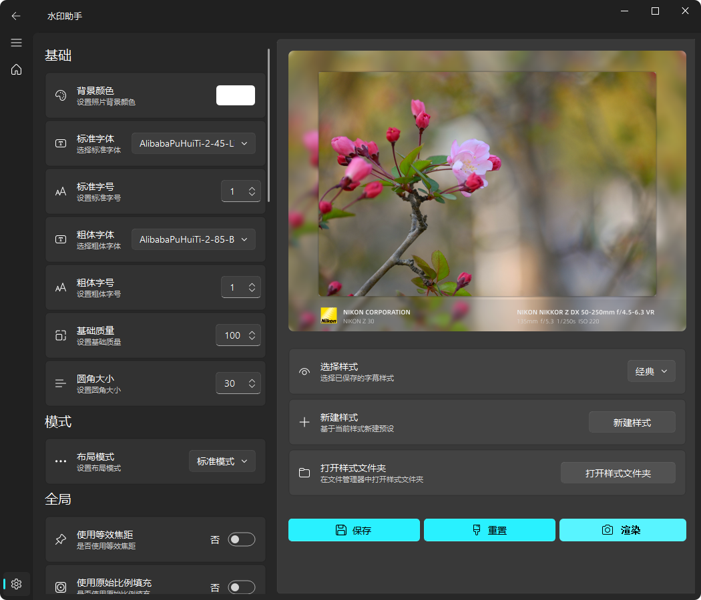
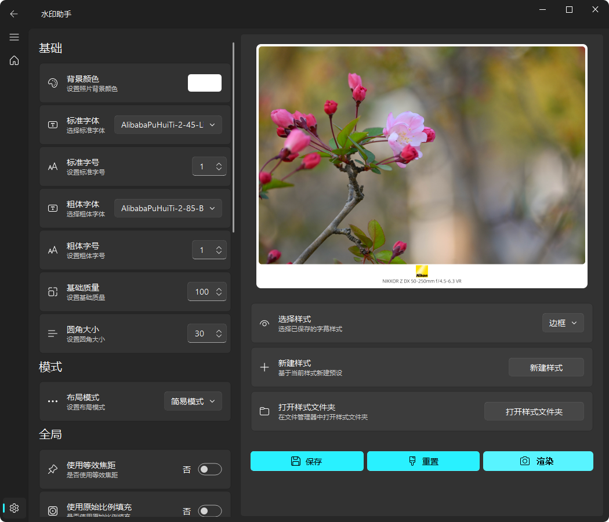
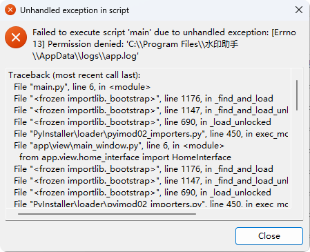
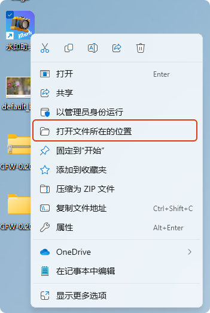
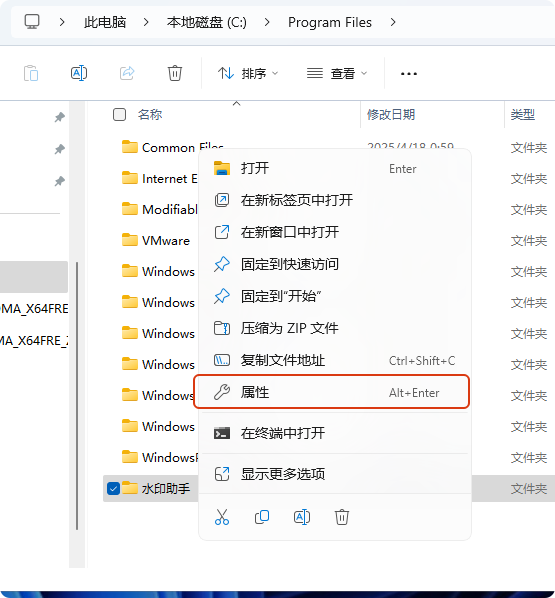
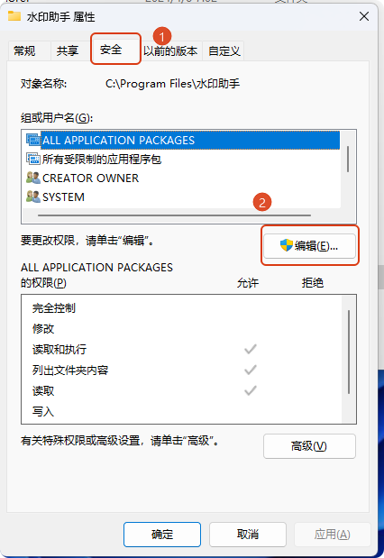
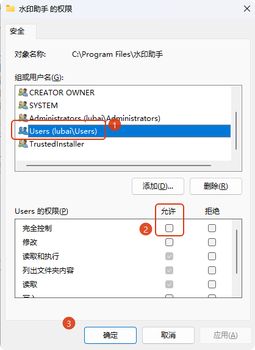

<div align="center">
  
  <h1>水印助手</h1>
  <p>一款用于给照片添加水印的助手，提取照片元数据，支持即时预览，批量添加水印。</p>
</div>


## 📜 基本功能

1. 批量添加水印，查看每一张照片的元数据内容。
2. 自定义设置水印内容，根据元数据进行排版展示。
3. 即时预览水印样式，随心所欲微调水印布局。
4. 提供圆角、阴影、背景模糊、白色边框等多种图片处理效果。
5. 支持自定义自己的多种样式风格，根据风格添加水印。

## 📷 界面预览


## 🛫 快速开始

### Windows

开箱即用，点击[下载链接](https://github.com/qianchuan0124/camera-water-mark/releases/download/v0.0.3/watermark-win.setup.exe)将安装文件下载到本地，双击setup.exe文件，按照指示进行安装，成功安装后点击桌面快捷方式图标即可使用。

### MacOS

开箱即用，点击[下载链接](https://github.com/qianchuan0124/camera-water-mark/releases/download/v0.0.3/watermark-mac.zip)将压缩包下载到本地，解压到当前目录，双击“水印助手”即可打开APP进行使用。

### 源码运行

1. 克隆源代码到本地

   ````bash
   git clone https://github.com/qianchuan0124/camera-water-mark.git
   ````

2. 创建虚拟环境并启动

   ````bash
   python -m venv .venv 
   
   # Windows下启动虚拟环境
   .venv/Scripts/activate
   
   # MacOS下启动虚拟环境
   source .venv/bin/activate
   ````

3. 安装相关依赖

   ````bash
   pip install -r requirements.txt
   ````

4. 运行程序

   ````bash
   python main.py
   ````

5. 打包

   ````bash
   # Windows下打成可安装包
   pyinstaller waterMark-win.spec
   
   # MacOS下打成可安装包
   pyinstaller waterMark-mac.spec
   ````


## ⤴️更新日志

### 2025.4.8 —— v0.0.3 更新

1. 添加元信息编辑功能
2. 添加海拔信息展示
3. 添加自定义Logo的功能

### 2025.6.6 —— v0.0.4更新

1. 新增简约、经典、边框三种可选样式
2. 简易模式支持自定义展示内容
3. 标准模式可不展示部分样式，支持调整左右间距与纵向比例
4. 全局背景色可设置不透明度，支持将水印设置在背景图之上
5. 支持在预览界面自定义原始预览图，更方便调节样式
6. 没有权限时增加相关提示，增加引导入口
7. 修复窗口位置与大小导致的展示问题
8. 修复阴影、边框等展示样式问题







## ⁉️问题解决

### 无法解析照片元数据

检查电脑上是否安装[exiftool](https://exiftool.org/)工具，安装包内自带，但是直接跑源码需要进行安装。

### Windows11无法打开

老版本会直接提示异常，新版本会显示没有读写权限:




有三种解决方法:

1. 右键，以管理员身份运行程序即可，但是每次都要右键运行，比较麻烦。
2. 重新安装，不要安装在C盘而是在其他权限要求较低的地方，能一次性解决，但是需要重新安装。
3. 授予权限，步骤较为繁琐，但是可以不需要重新安装且能一次性解决，步骤如下:









## 💖 感谢致敬

图片水印处理思路来源于[leslievan](https://github.com/leslievan)大佬的[semi-utils](https://github.com/leslievan/semi-utils)项目，感谢大佬提供的思路，本人只是做了一些微小的页面展示工作。

界面排版思路来源于[WEIFENG2333](https://github.com/WEIFENG2333)大佬的[VideoCaptioner](https://github.com/WEIFENG2333/VideoCaptioner)的项目，感谢大佬提供的排版思路。

UI图形库来源于[QFluentWidgets](https://qfluentwidgets.com/),此开源库类似于Web的Element-UI库，python工程用此库进行界面处理方便快捷，而且美观好看。